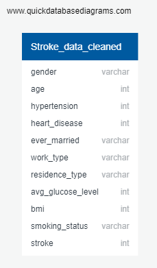
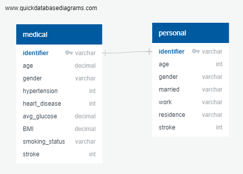

# Using Stroke Data for Machine Learning Predictions

## Presentation
[Slide Deck .pptx format](/Wilder/PowerPoint/Stroke%20ML%20Slide%20Deck.pptx) 

## Topic
 
The goal of this project is to use patient data to train machine learning models. 
**We hope to answer:**
1. How successfully can our model be used to predict stroke risk?
2. Which aspect is more accurate to predict risk: medical or personal data?
  
 
This topic is dear to many of our team members. Some of us were personally affected by loved ones having a stroke or actively work in the healthcare industry. Additionally, strokes are on the rise in younger people, and are therefore affecting a larger portion of the population. 
We are passionate about improving diagnosis options to prevent strokes. Having predictability may encourage preventative care or medication to reduce stroke risk.
 
 
## Data Source
The [source data](https://www.kaggle.com/fedesoriano/stroke-prediction-dataset) includes 5110 observations with 11 attributes. These attributes include medical and personal aspects of the patient such as age, average glucose level, BMI, marital status, and if the patient lives in a rural or urban area.
 
 
The dataset was submitted to Kaggle by user [fedesoriano](https://www.kaggle.com/fedesoriano). It is listed as a confidential datasource, but appears to be a cleaned subset of the Electronic Health Record (EHR) controlled by McKinsey & Company; originally used as part of their [healthcare hackathon](https://datahack.analyticsvidhya.com/contest/mckinsey-analytics-online-hackathon).
 
## Project Outline

 
## Data Exploration & Preprocessing
To explore the data we did a general overview using pivot tables to identify any inconsistencies or odd data patterns. In doing so, we found the following:
 
#### Age
We identified that the dataset includes information on children. After discussion, we decided to create age sets of 20 years for the model to run through. We believe that the youngest dataset will not have the same aspects as adults; marriage, smoking, and work type will not apply as frequently for patients under 20.  
[Age Datasets](/Resources/Age_Datasets)
 
#### BMI
We identified that we have a large percentage of NaNs for BMI data. At first we decided to exclude these patients from our dataset. However, we determined that this data was still valuable based on the following:
- Out of 201 NaNs, 40 had a stroke. That's 20% of the deleted data.
- Without the NaNs, there are ~200 positive stroke cases, about 4% of the dataset (200/5000)
- With the NaNs, the positivity rate for all the other categories increases 1%, from 4 to ~5% (250/5000)
- This gives us significantly more data points to help train the model.  
[BMI Datasets](/Resources/BMI_Datasets)
 
#### Glucose
We chose to separate the data based on glucose levels as well. This included breaking out three groups; normal, prediabetic, and diabetic.  
[Glucose Datasets](/Resources/Glucose_Datasets)

### ERD

## Feature Engineering and Selection

#### Feature Selection
"ID#", a column listing unique identifier values to each sample, is dropped from the feature data in the ML model as it an arbitrary value lacking relationship with other features or target. So far, all other available data features are used in the ML model to predict target stroke cases. A further exploration of ML overfitting will be conducted to determine if any noisy features should be dropped from the ML model.

#### Categorical Data
sklearn's OneHotEncoder is used to convert categorical data into numerical data. Categorical data such as "Gender" that contains only two values is split into two converse numerical columns where one of the two is dropped in order to mitigate redundancy in the ML model.

#### Null Data
As discussed above, the BMI feature data consists 201 null values. Since a chunk of our positive stroke cases is contained in these 201 samples, we've decided to populate these null values rather than drop the rows entirely. So far, two methods of populating BMI null values have been attempted: sklearn's SimpleImputer replaces null BMI values with median BMI values and sklearn's KNNImputer predicts and populates null BMI values.

#### Feature Scaling
sklearn's StandardScaler is used to scale feature data. Prior to scaling, most numerical data features contain only two unique values 0 and 1 as converted by sklearn's OneHotEncoder. Scaling is used to mitigate any ML model issues due to poor gradient descent.

#### Resampling
As discussed above, our dataset contains mostly negative stroke cases. Possibly due to using overwhelmingly negative stroke case data, ML model prediction prior to resampling showed positive stroke case recall as poor as 0%. A SMOTE oversampling method has been utilized in ML models resulting in positive stroke case recall as high as 48%.  

#### Training and Testing

Training & testing data is split using sklearn's train_test_split. Our ML dataset contains 5109 samples with 80% allocated to training and 20% to testing; 4087 training samples and 1022 testing samples. There are 17 features in our X set against 1 target in our y set.  

#### Model Choice

Currently, sklearn's AdaBoostClassifier supervised ML model returns the greatest positive stroke case recall. 48% positive stroke case recall is achieved with an AdaBoostClassifier and the above Feature Engineering and Selection techniques above (both KNNImputer and SimpleImputer techniques have achieved 48% positive stroke case recall).
* Figure below gives 03/20/2022 AdaBoostClassifier ML model result using SMOTE oversampling and KNNImputer population of missing BMI data

 
## Data Analysis

During early analysis we identified the following: 
- In general, women have a higher stroke risk.
- Age is heavily related to stroke risk. The higher the age, the higher the risk. However, after retirement age, women have a much higher risk than men.
- Men have heart attacks more often than strokes. There is an increase in chance of cardiac episode once the patient has had a stroke.
- More of the women in our dataset have a higher instance of hypertension.
- Even though they had a higher instance of stroke cases, we see that women smoke less overall. 
- We do not see a preliminary relationship between marriage status or home location as related to stroke and gender.

## Dashboard
 
Tools:  

Interactive elements:

 
 
## Communication Protocols
 
**Contact goals:**
- A minimum of twice weekly conversations through Slack
- Meeting at 6:30PM CT before class on Tuesdays and Thursdays
- Tracking deliverables through the Project Management spreadsheet
 
 
**The following will occur on an as-needed basis:**
- Video chat through Google Meet
- Feedback through GitHub pull requests
 
 
### Team Members
[Jack Bauer](https://github.com/jackary24)  
[Kelsey Corcoran](https://github.com/stereo-chemistry)  
[Katie Hopkins](https://github.com/HopkinsKV)  
[Angela Pacatte](https://github.com/angepacatte)  
[Bowen Wilder](https://github.com/boborodono)  
 
