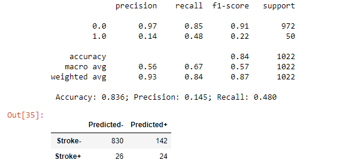

).svg)
<h1 align="center">Predicting Strokes with Machine Learning</h1>

<!-- Badges -->

   
   
   
   
   
   
   <a href="">
                                                                                                                                </a>
   

# Table of Contents

- [Presentation & Dashboard](#presentation--dashboard)
- [Topic](#topic)
  * [Why Would We Want to Predict Strokes?](#why-would-we-want-to-predict-strokes)
  * [Questions We Want to Answer...](#questions-we-want-to-answer)
- [Data Source](#data-source)
- [Project Outline](#project-outline)
- [Data Exploration & Preprocessing](#data-exploration--preprocessing)
- [ERD](#erd)
- [Feature Engineering and Selection](#feature-engineering-and-selection)
  * [Feature Selection](#feature-selection)
  * [Categorical Data](#categorical-data)
  * [Null Data](#null-data)
  * [Feature Scaling](#feature-scaling)
  * [Resampling](#resampling)
  * [Training and Testing](#training-and-testing)
  * [Model Choice](#model-choice) 
- [Data Analysis](#data-analysis)
- [Communication Protocols](#communication-protocols)
- [Authors](#authors)

# Tech Stack
<!-- Badges -->

  
   
   
   
   
   
   
   
   
   
   
   
   
   
   
   
   
   
   
   
   <a href="">
   
   

# Presentation & Dashboard

[SAML Presentation(Github)](/Wilder/PowerPoint/SAML_Stroke_Presentation.pdf) - [(Github Pages)](https://boborodono.github.io/SAML_PDF/SAML_Stroke_Presentation.pdf) 

[SAML Dashboard(Tableau Public)](https://public.tableau.com/app/profile/katie.hopkins/viz/SAML-StrokeData/MedicalDashboard) 

 
# Topic

## Why Would We Want to Predict Strokes?
This topic is dear to many of our team members. Some of us were personally affected by loved ones having a stroke or actively work in the healthcare industry. Additionally, strokes are on the rise in younger people, and are therefore affecting a larger portion of the population.
We are passionate about improving diagnosis options to prevent strokes. Having predictability may encourage preventative care or medication to reduce stroke risk.

## Questions We Want to Answer...
The goal of this project is to create a predictive analysis from stroke patient data using machine learning.
**We hope to answer:**
1. How successfully can our model be used to predict stroke risk?
2. Which aspect is more accurate to predict risk: medical or personal data?

# Data Source
The [source data](https://www.kaggle.com/fedesoriano/stroke-prediction-dataset) includes 5110 observations with 11 attributes. These attributes include medical and personal aspects of the patient such as age, average glucose level, BMI, marital status, and if the patient lives in a rural or urban area.

The dataset was submitted to Kaggle by user [fedesoriano](https://www.kaggle.com/fedesoriano). It is listed as a confidential datasource, but appears to be a cleaned subset of the Electronic Health Record (EHR) controlled by McKinsey & Company; originally used as part of their [Healthcare Hackathon](https://datahack.analyticsvidhya.com/contest/mckinsey-analytics-online-hackathon).

# Project Outline

# Exploratory Data Analysis (EDA)

## Stroke Dataset Overview
| Stats | Correlation Heatmap (Numeric) |
| :----: | :----: |
|  |   |
| **Shape:** 5,109 rows, 12 columns | **11 Features:** 8 Categorical, 3 Numerical |

## Missing Data
- 201 NaNs in "BMI" column
  - 40 NaNs had a stroke **(_20%_ of positive stroke data would be a part of the _deleted data_)**
  - Excluding "BMI" NaNs, there are ~200 positive stroke cases **(About _4%_ of the total dataset [200/5000])**
  - With NaNs, the stroke positivity rate for the entire dataset increases 1% **(From _~4_ to _~5%_ [250/5000])**
    - We included the missing 201 "BMI" NaNs in the Initial EDA
    - We filled in the missing 201 "BMI" NaNs in the ML model (and further EDA) with the Median "BMI" value

## Age 📃 [(Datasets)](/Resources/Age_Datasets)

We identified that the dataset includes information on children. After discussion, we decided to create age sets of 20 years for the model to run through. We believe that the youngest dataset will not have the same aspects as adults; marriage, smoking, and work type will not apply as frequently for patients under 20.
- The dataset was split into generational bins for further analysis

| Generation | Age Range | 
| :-------- | -------: |
| Gen Z | 0 - 20 | 
| Millenial | 20 - 40 | 
| Gen X | 40 - 60 | 
| Boomer | 60 - 80 | 
| Greatest Gen | 80 - 100 | 

| Histogram  | Stacked Bar | Stats |
| :----: | :----: | :----: |
|  |  |  <table><thead><tr><th></th><th>Age(years)</th></tr></thead><tbody><tr><td>count</td><td align="right" valign="middle">5,109</td></tr><tr><td>mean</td><td align="right" valign="middle">43.2</td></tr><tr><td>std</td><td align="right" valign="middle">22.6</td></tr><tr><td>min</td><td align="right" valign="middle">0.0</td></tr><tr><td>25%</td><td align="right" valign="middle">25.0</td></tr><tr><td>50%</td><td align="right" valign="middle">45.0</td></tr><tr><td>75%</td><td align="right" valign="middle">61.0</td></tr><tr><td>max</td><td align="right" valign="middle">82.0</td></tr></tbody></table> |
- There are more possible stroke cases from 0 - 60 years old 
  - However, positive stroke cases become more common with age 
- This shows that a higher proportion of positive stroke cases occur as age increases

## Gender
| Histogram  | Stacked Bar | Stats |
| :----: | :----: | :----: |
|  |  | <table><thead><tr><th></th><th>Age</th><th>(years)</th></tr><tr><th></th><th>count</th><th>mean</th></tr><tr><th>Gender</th><th></th><th></th></tr></thead><tbody><tr><td>Female</td><td align="right" valign="middle">2,994</td><td align="right" valign="middle">43.7</td></tr><tr><td>Male</td><td align="right" valign="middle">2,115</td><td align="right" valign="middle">42.5</td></tr></tbody></table> |
- According to the data, significantly more women were admitted for possible cases of a stroke
- The percentage of positive stroke cases is about even between men and women 

 

 
|Personal Criteria | Medical Criteria |
|--|--|
|<table> <tr><th>Personal Category</th><th>Criteria</th></tr><tr><td>Ever Married</td><td align="right" valign="middle">Yes</td></tr><tr><td></td><td align="right" valign="middle">No</td></tr><tr><td>Work Type</td><td align="right" valign="middle">Private</td></tr><tr><td></td><td align="right" valign="middle">Self-Employed</td></tr><tr><td></td><td align="right" valign="middle">Government Job</td></tr><tr><td></td><td align="right" valign="middle">Children</td></tr><tr><td>Residence Type</td><td align="right" valign="middle">Urban Job</td></tr><tr><td></td><td align="right" valign="middle">Rural</td></tr><tr><td>Smoker</td><td align="right" valign="middle">Never</td></tr><tr><td></td><td align="right" valign="middle">Former</td></tr><tr><td></td><td align="right" valign="middle">Current</td></tr><tr><td></td><td align="right" valign="middle">Unknown</td></tr> </table>|<table> <tr><th>Medical Category</th><th>Criteria</th></tr><tr><td>BMI</td><td align="right" valign="middle">0-100</td></tr><tr><td>Glucose</td><td align="right" valign="middle">0-125</td></tr><tr><td>Hypertension</td><td align="right" valign="middle">Yes</td></tr><tr><td></td><td align="right" valign="middle">No</td></tr><tr><td>Heart Disease</td><td align="right" valign="middle">Yes</td></tr><tr><td></td><td align="right" valign="middle">No</td></tr> </table>| 
   
 # Personal Criteria
 
 ## Ever Married
| Stacked Bar | Stats |
|  :----: |  :----: |
|  | <table><thead><tr><th></th><th>Age</th><th>(years)</th></tr><tr><th></th><th>count</th><th>mean</th></tr><tr><th>Ever Married</th><th></th><th></th></tr></thead><tbody><tr><td>No</td><td align="right" valign="middle">1,756</td><td align="right" valign="middle">22.0</td></tr><tr><td>Yes</td><td align="right" valign="middle">3,353</td><td align="right" valign="middle">54.3</td></tr></tbody></table> |
- More instances of stroke were reported among patients that were married at one point in time
 
 
 
 ### Work Type
| Stacked Bar | Stats | 
|  :----: |  :----: | 
|  |  <table><thead><tr><th></th><th>Age</th><th>(years)</th></tr><tr><th></th><th>count</th><th>mean</th></tr><tr><th>Work Type</th><th></th><th></th></tr></thead><tbody><tr><td>Government</td><td align="right" valign="middle">657</td><td align="right" valign="middle">50.9</td></tr><tr><td>Never Worked</td><td align="right" valign="middle">22</td><td align="right" valign="middle">16.2</td></tr><tr><td>Private</td><td align="right" valign="middle">2,924</td><td align="right" valign="middle">45.5</td></tr><tr><td>Self-Employed</td><td align="right" valign="middle">819</td><td align="right" valign="middle">60.2</td></tr><tr><td>Child-Rearing</td><td align="right" valign="middle">687</td><td align="right" valign="middle">6.8</td></tr></tbody></table> |
- "Self-Employed" workers have the highest prevalance of positive stroke cases but not statistically different from patients employed by "Private" or "Government" organizations
 

 
 ### Residence Type
| Stacked Bar | Stats |
|  :----: |  :----: |
|  |  <table><thead><tr><th></th><th>Age</th><th>(years)</th></tr><tr><th></th><th>count</th><th>mean</th></tr><tr><th>Residence Type</th><th></th><th></th></tr></thead><tbody><tr><td>Rural</td><td align="right" valign="middle">2,513</td><td align="right" valign="middle">42.9</td></tr><tr><td>Urban</td><td align="right" valign="middle">2,596</td><td align="right" valign="middle">43.5</td></tr></tbody></table> |
- No perceivable difference detected in instances of stroke between those in "Rural" v. "Urban" Residences
 
 
 
 ### Smoking Status
| Histogram  | Stacked Bar | Stats |
| :----: | :----: | :----: | 
|  |  |  <table><thead><tr><th></th><th>Age</th><th>(years)</th></tr><tr><th></th><th>count</th><th>mean</th></tr><tr><th>Smoker</th><th></th><th></th></tr></thead><tbody><tr><td>Current</td><td align="right" valign="middle">789</td><td align="right" valign="middle">47.1</td></tr><tr><td>Former</td><td align="right" valign="middle">884</td><td align="right" valign="middle">55.0</td></tr><tr><td>Never</td><td align="right" valign="middle">1,892</td><td align="right" valign="middle">46.7</td></tr><tr><td>Unknown</td><td align="right" valign="middle">1,544</td><td align="right" valign="middle">30.2</td></tr></tbody></table> |
- Most patients never smoked but many patient's smoking history is "Unknown"

 
 ## Medical Criteria
    
### BMI 📃 [(Datasets)](/Resources/BMI_Datasets)
- The dataset was split into BMI Class bins for further analysis

| BMI Class | BMI Range | 
| :-------- | -------: |
| Underweight | 0 - 18.5 | 
| Healthy Weight | 18.5 - 25 | 
| Overweight | 25 - 30 | 
| Obese(Low-Risk) | 30 - 35 | 
| Obese(Medium-Risk) | 35 - 40 |
| Obese(High-Risk) | 40 - 100 |
   
| Histogram  | Stacked Bar | Stats |
| :----: | :----: | :----: |
|  |  |  <table><thead><tr><th></th><th>BMI</th></tr></thead><tbody><tr><td>count</td><td align="right" valign="middle">4,908</td></tr><tr><td>mean</td><td align="right" valign="middle">28.9</td></tr><tr><td>std</td><td align="right" valign="middle">7.8</td></tr><tr><td>min</td><td align="right" valign="middle">10.3</td></tr><tr><td>25%</td><td align="right" valign="middle">23.5</td></tr><tr><td>50%</td><td align="right" valign="middle">28.1</td></tr><tr><td>75%</td><td align="right" valign="middle">33.1</td></tr><tr><td>max</td><td align="right" valign="middle">97.6</td></tr></tbody></table> |
- A majority of patients are "Overweight" or "Obese" 
- "Overweight" or "Obese" patients have a higher prevalence for developing a stroke

 ### Average Glucose Levels (AGL) 📃 [(Datasets)](/Resources/Glucose_Datasets)
We chose to separate the data based on glucose levels as well. This included breaking out three groups; normal, prediabetic, and diabetic.
- The dataset was split Glucose Level Class bins for further analysis

| Glucose Level Class | Glucose Range | 
| :-------- | -------: |
| Normal | 0 - 100 | 
| Prediabetic | 100 - 125 | 
| Diabetic | >125 |
   
| Histogram  | Stacked Bar | Stats | 
| :----: | :----: | :----: | 
|  | |  <table><thead><tr><th></th><th>AGL(mg/dL)</th></tr></thead><tbody><tr><td>count</td><td align="right" valign="middle">5,109</td></tr><tr><td>mean</td><td align="right" valign="middle">106.1</td></tr><tr><td>std</td><td align="right" valign="middle">45.3</td></tr><tr><td>min</td><td align="right" valign="middle">55.1</td></tr><tr><td>25%</td><td align="right" valign="middle">77.2</td></tr><tr><td>50%</td><td align="right" valign="middle">91.9</td></tr><tr><td>75%</td><td align="right" valign="middle">114.1</td></tr><tr><td>max</td><td align="right" valign="middle">271.7</td></tr></tbody></table> |
- Most patients were in the "Normal" Glucose Level range
- Patients diagnosed as "Diabetic" had a higher prevalence of stroke cases
 
 
    
 ### Hypertension
| Stacked Bar |
|  :----: |
|  | 
- Patients diagnosed with Hypertension had a a higher prevalence of stroke cases
 

 
 ### Heart Disease
| Stacked Bar |
|  :----: |
|  | 
- Patients diagnosed with Heart Disease had a a higher prevalence of stroke cases

# ERD

# Feature Engineering and Selection

## Feature Selection
"ID#", a column listing unique identifier values to each sample, is dropped from the feature data in the ML model as it an arbitrary value lacking relationship with other features or target. So far, all other available data features are used in the ML model to predict target stroke cases. A further exploration of ML overfitting will be conducted to determine if any noisy features should be dropped from the ML model.

## Categorical Data
sklearn's OneHotEncoder is used to convert categorical data into numerical data. Categorical data such as "Gender" that contains only two values is split into two converse numerical columns where one of the two is dropped in order to mitigate redundancy in the ML model.

## Null Data
As discussed above, the BMI feature data consists 201 null values. Since a chunk of our positive stroke cases is contained in these 201 samples, we've decided to populate these null values rather than drop the rows entirely. So far, two methods of populating BMI null values have been attempted: sklearn's SimpleImputer replaces null BMI values with median BMI values and sklearn's KNNImputer predicts and populates null BMI values.

## Feature Scaling
sklearn's StandardScaler is used to scale feature data. Prior to scaling, most numerical data features contain only two unique values 0 and 1 as converted by sklearn's OneHotEncoder. Scaling is used to mitigate any ML model issues due to poor gradient descent.

## Resampling
As discussed above, our dataset contains mostly negative stroke cases. Possibly due to using overwhelmingly negative stroke case data, ML model prediction prior to resampling showed positive stroke case recall as poor as 0%. A SMOTE oversampling method has been utilized in ML models resulting in positive stroke case recall as high as 48%.

## Training and Testing

Training & testing data is split using sklearn's train_test_split. Our ML dataset contains 5109 samples with 80% allocated to training and 20% to testing; 4087 training samples and 1022 testing samples. There are 17 features in our X set against 1 target in our y set.

## Model Choice
We started with sklearn's Random Forest Classifier (RFC). These models give the highest overall accuracy, but the poorest positive stroke case recall. After preprocessing, RFC models achieve correctly label 28%-40% of positive strokes using different data preprocessing methods.  

As of now, sklearn's AdaBoostClassifier supervised ML model returns the greatest positive stroke case recall. 48% positive stroke case recall is achieved with an AdaBoostClassifier and the above Feature Engineering and Selection techniques above (both KNNImputer and SimpleImputer techniques have achieved 48% positive stroke case recall). Currently, sklearn's Support Vector Classifier (SVC) has achieved the greatest 92% positive stroke case recall with lower overall accuracy than the AdaBoostClassifier and RandomForestClassifier models.
* Figure below gives 03/20/2022 AdaBoostClassifier ML model result using SMOTE oversampling and KNNImputer population of missing BMI data

* Figure below gives 03/24/2022 SVC ML model result using RandomOverSampler oversampler and SimpleImputer population of missing BMI data with median BMI feature value.

_03.24.2024.png)

# Data Analysis

During early analysis we identified the following:
- In general, women have a higher stroke risk.
- Age is heavily related to stroke risk. The higher the age, the higher the risk. However, after retirement age, women have a much higher risk than men.
- Men have heart attacks more often than strokes. There is an increase in chance of cardiac episode once the patient has had a stroke.
- More of the women in our dataset have a higher instance of hypertension.
- Even though they had a higher instance of stroke cases, we see that women smoke less overall.
- We do not see a preliminary relationship between marriage status or home location as related to stroke and gender#.

# Communication Protocols

**Contact goals:**
- A minimum of twice weekly conversations through Slack
- Meeting at 6:30PM CT before class on Tuesdays and Thursdays
- Tracking deliverables through the  spreadsheet

**The following will occur on an as-needed basis:**
- Video chat through Google Meet
- Feedback through GitHub pull requests

# Authors
| Author | My Repo     |  LinkedIn                |
| :-------- | :------- | :------------------------- |
| Jack Bauer | | |
| Kelsey Corcoran |       | |
| Katie Hopkins |      |                 |
| Angela Pacatte |      |                 |
| Bowen Wilder |      |                 |

 

